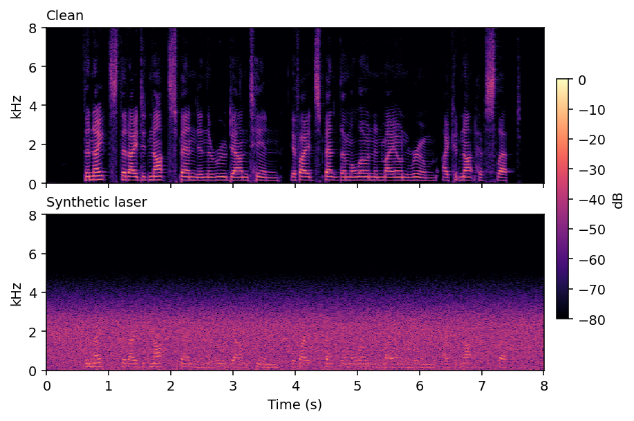
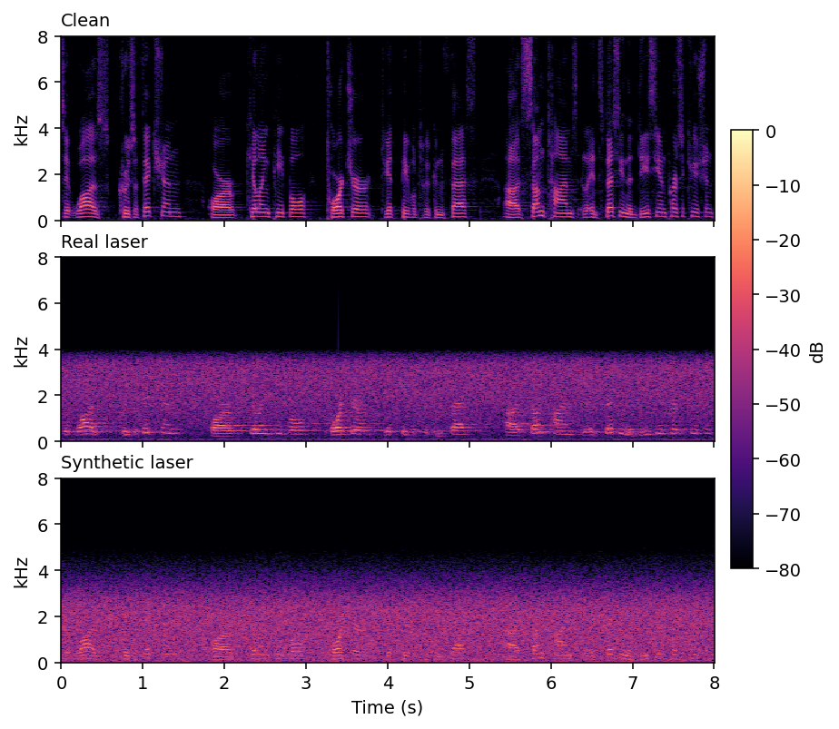

# LaserSpeech

Physics-based synthesis of **laser Doppler vibrometry (LDV) speech**, plus the real LDV
recordings used in the paper.

> **Note.** LaserSpeech is a *proxy* for real LDV data. It reproduces the dominant
> degradations of optical vibrometry and matches the real acoustic-quality profile
> (PESQ/STOI/WER). 

---

## What's here

| | |
|---|---|
| `laserspeech.py` | The synthesis pipeline (5 degradation mechanisms, interpretable parameters). |
| `reproduce_laserspeech460.py` | Regenerates the full **LaserSpeech-460** corpus from LibriSpeech. |
| `figures/` | Spectrogram comparisons (see below). |
| `samples/` | Example clips matching the two figures. |

### Figures

**`figures/librispeech_clean_vs_synth.png`** — what the released corpus looks like: a clean
LibriSpeech utterance and the synthetic-laser signal produced from it.

**`figures/real_vs_synth_spectrogram.png`** — the calibration: for the *same* utterance, the
clean close-talk reference, the real LDV channel, and the synthetic-laser signal generated from
that clean reference at the LaserSpeech-460 operating point. The synthesis reproduces the
bandwidth limiting (effective &minus;20 dB rolloff at 3.4 kHz, against 3.6 kHz for the real
signal), the broadband noise floor, and the preserved low-frequency speech modulation.

### Samples

| file | |
|---|---|
| `samples/librispeech_clean.wav` | clean LibriSpeech |
| `samples/librispeech_synth_laser.wav` | synthetic laser from it |
| `samples/real_clean.wav` | close-talk reference |
| `samples/real_laser.wav` | real LDV channel |
| `samples/real_synth_laser.wav` | synthetic laser from the same clean reference |

The `real_*` clips are an 8 s excerpt of a ~30 s recording, time-aligned across the three.

The **synthetic corpus is not distributed as audio** — it is regenerated locally from the
public LibriSpeech release. The **real LDV recordings** are hosted separately, since
they cannot be regenerated.

---

## Install

```bash
pip install -r requirements.txt
```

## Regenerate LaserSpeech-460

Download LibriSpeech [`train-clean-360`](https://www.openslr.org/12) (and `train-clean-100`
for the full 460 h), then:

```bash
python reproduce_laserspeech460.py \
    --librispeech /path/to/LibriSpeech/train-clean-360 \
    --out ./LaserSpeech-460 \
    --workers 8
```

This mirrors the LibriSpeech directory layout and writes one synthetic-laser `.wav` per
utterance (16 kHz, ~20 GB for the full 460 h). Pair each output with its original LibriSpeech
clean audio and transcript.

**Reproducibility.** Each utterance's noise is seeded from its LibriSpeech id, so the output
is **bit-exact** regardless of file order or `--workers`. Leave `--seed` at its default to
reproduce the published corpus.

### Operating points

| Preset | α (purple) | β (Gaussian) | w (speech) | σ (smear) | f_lpf | f_nyq | Matches |
|---|---|---|---|---|---|---|---|
| `default` | 0.5 | 0.5 | 0.4 | 0.5 | 2000 Hz | 2500 Hz | LargeKappa (easier surface) |
| `hard` | 1.5 | 0.5 | 0.3 | 1.0 | 2000 Hz | 2500 Hz | WoodenFaceBox (harder surface) |

```bash
python reproduce_laserspeech460.py ... --preset hard
```

### Synthesize a single file

```python
import soundfile as sf
from laserspeech import synthesize, utterance_seed

clean, fs = sf.read("utt.wav")
laser = synthesize(clean, fs, seed=utterance_seed("utt"))
sf.write("utt_laser.wav", laser, fs)
```

### Tuning for a new surface

The parameters depend on the target surface, standoff distance, and hardware, so no single
configuration transfers everywhere. To calibrate: record a few utterances on your target
surface alongside a close-talk reference, measure PESQ/STOI/WER, and adjust parameters accordingly.

---

## Real LDV recordings

Acquired in an acoustically treated laboratory with a Polytec PDV-100 digital laser
vibrometer. Lectures from two speakers were reproduced through a loudspeaker at the target
surface, and the resulting surface vibration was measured across two surfaces
(Wooden Box at 5 m, Kappa at 3 m). Each recording provides three synchronized
16 kHz tracks:

- `channel_clean` — simultaneous close-talk microphone reference
- `channel_x`, `channel_y` — the two orthogonal laser measurement axes

**Source audio.** The reproduced lectures come from
[Open Yale Courses](https://oyc.yale.edu): Keith E. Wrightson (HIST 251, *Early Modern
England*) and Dale B. Martin (RLST 152, *Introduction to New Testament History and
Literature*), used under CC BY-NC-SA 3.0.

**Download:** *(Zenodo DOI — to be added)*

---





---

## Citation

```bibtex
@inproceedings{bederov2026laserspeech,
  title     = {LaserSpeech: Physics-Based Modeling of Optical Vibrometry for
               Large-Scale Laser Speech Recognition},
  author    = {Bederov, Emily and Berdugo, Baruch and Cohen, Israel},
  booktitle = {Proc. IWAENC},
  year      = {2026}
}
```

## License

- **Code:** MIT.
- **Real LDV recordings:** CC BY-NC-SA 3.0.

The real recordings are derived from Open Yale Courses lectures (Wrightson, HIST 251; Martin,
RLST 152), which are licensed CC BY-NC-SA 3.0. The recordings are therefore released under the
same terms: attribution to Open Yale Courses and the respective lecturer, non-commercial use,
and share-alike for derivatives.
